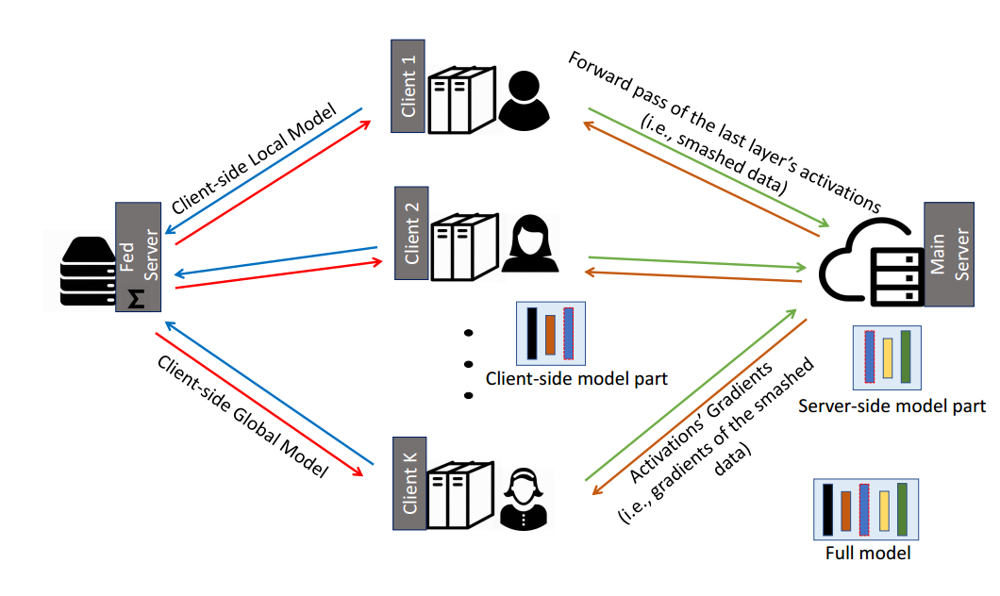

## 联邦拆分学习 spiltfed learning SFL
参考论文
[Splitfed When federated learning meets split learning_AAAI_2022](https://arxiv.org/pdf/2004.12088.pdf)

参考代码
https://github.com/chandra2thapa/SplitFed-When-Federated-Learning-Meets-Split-Learning

上述参考代码的详细中文注释（SFLV1）： sflv1.py
来源于[博客](https://blog.csdn.net/weixin_42303403/article/details/129928984)


- 框架

    - fed server
    - client-side
    - main server

### 流程

**每轮迭代流程**
- 每一批次batch都需要服务器和客户端交换数据，所有批次结束，使用了整个数据集所有样本一次
- 客户端可以本地迭代多轮local_epoch，默认本地迭代只有一轮
- 只有所有客户端本地迭代均完成，才算完成一次全局迭代epoch

*每个batch过程中*

**通信0**  client (前半部分forward) ====(激活层输出，样本标签)====> main server（后半部分forward）

**通信1**  client (前半部分back) <====(梯度)==== main server（后半部分back）

*每个local_epoch结束后*

**通信2**  client ====(本地权重)====> fed 

*每个epoch结束后，fed进行客户端权重聚合*

**通信3**  client <====(整体平均化权重)==== fed 


每个batch进行一次通信0和通信1，每个epoch进行一次通信2和通信3。

由于一个epoch包含多个batch，因此在一个epoch中，会包含多次（次数等于batch数）通信0和通信1，以及一次通信2和通信3。

### 算法
- 服务端server
    - main 模型的后半部分的前向/后向传播
    1. 注意每次client传来的粉碎数据都要处理，并保存梯度副本用于最后更新
    2. 更新server权重是在所有client的数据都处理过之后，即每轮最后

    - fed 聚合client的梯度，回传给client
    1. 不需要有client模型，只需要记录各个client权重的副本，用于聚合
    2. 在各个client后向传播结束后进行聚合
    
- 客户端client
0. 各个client所用数据集互斥
1. 模型的前半部分的前向传播
2. 等main前后传播之后，再后向传播
3. 等fed进行聚合更新


伪代码（参考论文中的英文伪代码）：
- 客户端更新算法
```
1  for 每一个轮次t (t=0,1,2…T) ：
2    接收W_(C,t)←联邦服务器聚合算法（第5或13行）
3    执行前向传播，在W_(C,t)上使用X_k计算得到A_(k,t)
4    发送(A_(k,t),Y_k)→主服务器更新算法（第6行）
5    接收∇l_k (A_(k,t))←主服务器更新算法（第10行）
6    执行后向传播，基于W_(C,t)使用∇l_k (A_(k,t))计算更新W_(C,k,t)
7    发送W_(C,k,t)→联邦服务器聚合算法（第9行）
8  end for
```

- 主服务器更新算法
```
1   for 每一个轮次t (t=0,1,2…T) ：
2     if t=0 ：
3       初始化W_(S,t)（全局服务器权重）
4     else 
5       for 每一个客户端C_k  (k=1,2…n) ：
6         接收(A_(k,t),Y_k)←客户端更新算法（第4行）
7         执行前向传播，在W_(S,t)上使用A_(k,t)计算得到(Y_k ) ̂
8         用Y_k和 (Y_k ) ̂计算损失函数值与准确率
9         执行后向传播，计算得到∇l_k (A_(k,t))和W_(S,k,t)
10        发送∇l_k (A_(k,t))→客户端更新算法（第5行）
11      end for
12      更新服务器权重W_(S,t+1)=∑_(k=1)^n (m_k/m)·W_(S,k,t)
13    end if
14  end for
```

- 联邦服务器更新算法
```
1	for 每一个轮次t (t=0,1,2…T) ：
2	  if t=0 ：
3	    初始化W_(C,t)（全局客户端权重）
4	    for 每一个客户端C_k  (k=1,2…n) ：
5	      发送W_(C,t)→客户端更新算法（第2行）
6	    end for
7	  else 
8	    for 每一个客户端C_k  (k=1,2…n) ：
9	      接收W_(C,k,t)←客户端更新算法（第7行）
10	    end for
11	    更新客户端权重W_(C,t+1)=∑_(k=1)^n (m_k/m)·W_(C,k,t)
12	    for 每一个客户端C_k  (k=1,2…n) ：
13	      发送W_(C,t+1)→客户端更新算法（第2行）
14	    end for
15	  end if
16  end for
```


#### 论文提到的两个变体
- 基于服务端的聚合 sfl-v1（已实现）

- 基于数据标签共享 sfl-v2（未实现）


### 分割
参考struct-split.png示意图

split=2的情况如下
```
ResNet18_client_side(
  (layer1): Sequential(
    (0): Conv2d(3, 64, kernel_size=(7, 7), stride=(2, 2), padding=(3, 3), bias=False)
    (1): BatchNorm2d(64, eps=1e-05, momentum=0.1, affine=True, track_running_stats=True)
    (2): ReLU(inplace=True)
    (3): MaxPool2d(kernel_size=3, stride=2, padding=1, dilation=1, ceil_mode=False)
  )
  (layer2): Sequential(
    (0): Conv2d(64, 64, kernel_size=(3, 3), stride=(1, 1), padding=(1, 1), bias=False)
    (1): BatchNorm2d(64, eps=1e-05, momentum=0.1, affine=True, track_running_stats=True)
    (2): ReLU(inplace=True)
    (3): Conv2d(64, 64, kernel_size=(3, 3), stride=(1, 1), padding=(1, 1))
    (4): BatchNorm2d(64, eps=1e-05, momentum=0.1, affine=True, track_running_stats=True)
  )
)
```

```
ResNet18_server_side(
  (layer3): Sequential(
    (0): Conv2d(64, 64, kernel_size=(3, 3), stride=(1, 1), padding=(1, 1))
    (1): BatchNorm2d(64, eps=1e-05, momentum=0.1, affine=True, track_running_stats=True)
    (2): ReLU(inplace=True)
    (3): Conv2d(64, 64, kernel_size=(3, 3), stride=(1, 1), padding=(1, 1))
    (4): BatchNorm2d(64, eps=1e-05, momentum=0.1, affine=True, track_running_stats=True)
  )
  (layer4): Sequential(
    (0): Baseblock(
      (conv1): Conv2d(64, 128, kernel_size=(3, 3), stride=(2, 2), padding=(1, 1))
      (bn1): BatchNorm2d(128, eps=1e-05, momentum=0.1, affine=True, track_running_stats=True)
      (conv2): Conv2d(128, 128, kernel_size=(3, 3), stride=(1, 1), padding=(1, 1))
      (bn2): BatchNorm2d(128, eps=1e-05, momentum=0.1, affine=True, track_running_stats=True)
      (dim_change): Sequential(
        (0): Conv2d(64, 128, kernel_size=(1, 1), stride=(2, 2))
        (1): BatchNorm2d(128, eps=1e-05, momentum=0.1, affine=True, track_running_stats=True)
      )
    )
    (1): Baseblock(
      (conv1): Conv2d(128, 128, kernel_size=(3, 3), stride=(1, 1), padding=(1, 1))
      (bn1): BatchNorm2d(128, eps=1e-05, momentum=0.1, affine=True, track_running_stats=True)
      (conv2): Conv2d(128, 128, kernel_size=(3, 3), stride=(1, 1), padding=(1, 1))
      (bn2): BatchNorm2d(128, eps=1e-05, momentum=0.1, affine=True, track_running_stats=True)
    )
  )
  (layer5): Sequential(
    (0): Baseblock(
      (conv1): Conv2d(128, 256, kernel_size=(3, 3), stride=(2, 2), padding=(1, 1))
      (bn1): BatchNorm2d(256, eps=1e-05, momentum=0.1, affine=True, track_running_stats=True)
      (conv2): Conv2d(256, 256, kernel_size=(3, 3), stride=(1, 1), padding=(1, 1))
      (bn2): BatchNorm2d(256, eps=1e-05, momentum=0.1, affine=True, track_running_stats=True)
      (dim_change): Sequential(
        (0): Conv2d(128, 256, kernel_size=(1, 1), stride=(2, 2))
        (1): BatchNorm2d(256, eps=1e-05, momentum=0.1, affine=True, track_running_stats=True)
      )
    )
    (1): Baseblock(
      (conv1): Conv2d(256, 256, kernel_size=(3, 3), stride=(1, 1), padding=(1, 1))
      (bn1): BatchNorm2d(256, eps=1e-05, momentum=0.1, affine=True, track_running_stats=True)
      (conv2): Conv2d(256, 256, kernel_size=(3, 3), stride=(1, 1), padding=(1, 1))
      (bn2): BatchNorm2d(256, eps=1e-05, momentum=0.1, affine=True, track_running_stats=True)
    )
  )
  (layer6): Sequential(
    (0): Baseblock(
      (conv1): Conv2d(256, 512, kernel_size=(3, 3), stride=(2, 2), padding=(1, 1))
      (bn1): BatchNorm2d(512, eps=1e-05, momentum=0.1, affine=True, track_running_stats=True)
      (conv2): Conv2d(512, 512, kernel_size=(3, 3), stride=(1, 1), padding=(1, 1))
      (bn2): BatchNorm2d(512, eps=1e-05, momentum=0.1, affine=True, track_running_stats=True)
      (dim_change): Sequential(
        (0): Conv2d(256, 512, kernel_size=(1, 1), stride=(2, 2))
        (1): BatchNorm2d(512, eps=1e-05, momentum=0.1, affine=True, track_running_stats=True)
      )
    )
    (1): Baseblock(
      (conv1): Conv2d(512, 512, kernel_size=(3, 3), stride=(1, 1), padding=(1, 1))
      (bn1): BatchNorm2d(512, eps=1e-05, momentum=0.1, affine=True, track_running_stats=True)
      (conv2): Conv2d(512, 512, kernel_size=(3, 3), stride=(1, 1), padding=(1, 1))
      (bn2): BatchNorm2d(512, eps=1e-05, momentum=0.1, affine=True, track_running_stats=True)
    )
  )
  (averagePool): AvgPool2d(kernel_size=7, stride=1, padding=0)
  (fc): Linear(in_features=512, out_features=7, bias=True)
)
```